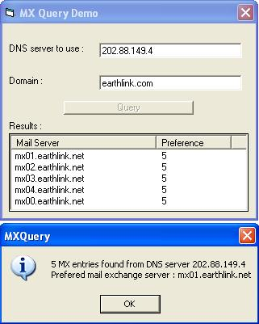



## MX Query

### Description

This code looks up MX (Mail eXchange) records for any domain from a DNS server (For those who dont know what a MX record is, MX records contain the name of the SMTP server which receives mail for a domain).

This is an improvement (I hope so :) over Jason Martin's code (http://www.planet-source-code.com/vb/scripts/ShowCode.asp?txtCodeId=11006&lngWId=1). Here are the changes I made:

1. It uses winsock and not API for the query.

2. It wont freeze if you give a non-existent domain or DNS server.

3. It gets the DNS server in use by your computer by network api instead of registry.

4. There was a bug in Jason's code due to which if the DNS response was compressed it would return only the first MX record. For example, Jason's code would return one MX record for earthlink.com while mine will return all five.

I'll appreciate any feedback on this code.
 
### More Info
 
The MX records of a domain.

             |
---                |---
**Submitted On**   |2002-04-22 04:47:40
**By**             |[Saurabh Gupta](https://github.com/Planet-Source-Code/PSCIndex/blob/master/ByAuthor/saurabh-gupta.md)
**Level**          |Intermediate
**User Rating**    |4.4 (66 globes from 15 users)
**Compatibility**  |VB 5\.0, VB 6\.0
**Category**       |[Internet/ HTML](https://github.com/Planet-Source-Code/PSCIndex/blob/master/ByCategory/internet-html__1-34.md)
**World**          |[Visual Basic](https://github.com/Planet-Source-Code/PSCIndex/blob/master/ByWorld/visual-basic.md)
**Archive File**   |[MX\_Query743404212002\.zip](https://github.com/Planet-Source-Code/saurabh-gupta-mx-query__1-34016/archive/master.zip)

### API Declarations

A few in the code.

